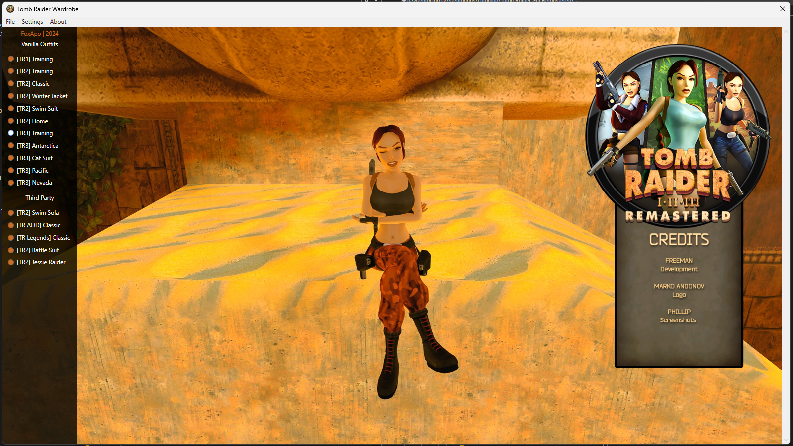

<div style="text-align: center;">
    <a href="https://www.buymeacoffee.com/foxapogames">
        
    </a>
    <br/>
    <a href = "https://paypal.me/foxapo">
        
    </a>
</div>

# Tomb Raider Wardrobe
- Simple mod for **Tomb Raider I-III Remastered** that allows you to change Lara's outfit in-game.
- App is written in .NET 8 as WPF application and can be changed according to your needs

## Installation
- Place the `TRWardrobe.exe` in the game's root folder
- Start the app and select your outfit
- Close the app and start the game
- ENJOY

## Example of the configuration

### Folder Structure
```bash
MOD_OUTFITS/
├── BLUE_WINTER.TRM
├── JESSIE.TRM
├── OUTFIT_AOD.TRM
├── OUTFIT_TR_LEGENDS.TRM
├── battlesuit
│   ├── 1
│   │   └── TEX
│   │       ├── 8110.DDS
│   │       ├── 8111.DDS
│   │       └── 8112.DDS
│   ├── 8110.DDS
│   ├── 8111.DDS
│   └── 8112.DDS
├── jessie
│   ├── 1
│   │   └── TEX
│   │       ├── 8003.dds
│   │       └── 8040.dds
│   ├── 8003.dds
│   └── 8040.dds
└── tr2Sola
    └── 1
        └── TEX
            └── 8060.DDS
```

### Config.json
```json
{
  "CurrentOutfit": "",
  "VanillaOutfits": [
  /// ...AUTO GENERATED
  ],
  "ModdedOutfits": [
    {
      "Key": "tr2Sola_MODDED", // _MODDED is a suffix for the program to determine that this key is modded (_MODDED is added automatically)
      "Filename": "OUTFIT_TR2_SWIM.TRM",
      "DisplayName": "[TR2] Swim Sola",
      "IsOnlyTexture": true,
      "Textures": [
        "8060.DDS"
      ]
    },
    {
      "Key": "aod_MODDED",
      "Filename": "OUTFIT_AOD.TRM", // This mod contains its own textures so there is no need to specify them
      "DisplayName": "[TR AOD] Classic",
      "IsOnlyTexture": false
    },
    {
      "Key": "trlegend_MODDED",
      "Filename": "OUTFIT_TR_LEGENDS.TRM", // This mod contains its own textures so there is no need to specify them
      "DisplayName": "[TR Legends] Classic",
      "IsOnlyTexture": false
    },
    {
      "Key": "battlesuit_MODDED",
      "Filename": "OUTFIT_TR3_CATSUIT.TRM", 
      "DisplayName": "[TR2] Battle Suit",
      "IsOnlyTexture": true,
      "Textures": [
        "8112.DDS",
        "8111.DDS",
        "8110.DDS"
      ]
    },
    {
      "Key": "jessie_MODDED",
      "Filename": "JESSIE.TRM",
      "DisplayName": "[TR2] Jessie Raider",
      "IsOnlyTexture": false,
      "Textures": [
        "8003.DDS",
        "8040.DDS"
      ]
    }
  ]
}
```

## How it works
- When you first launch the app, it will automatically create a BKP folder in the TR folder and place all the Outfit
  related files inside
- When you start the app, you can choose the outfit and all the outfits in the game are replaced by this outfit so you
  can be sure that your desired outfit will be across the all games.
- If you want to set default outfits, just press "RESTORE"

## Requirements
- .NET 8 Runtime

## Credits
- [andonvmarko](https://www.deviantart.com/andonovmarko/art/Tomb-Raider-I-III-Remastered-Icon-1023270894) for the icon of the executable
- Phillip for the screenshots for each vanilla outfit


